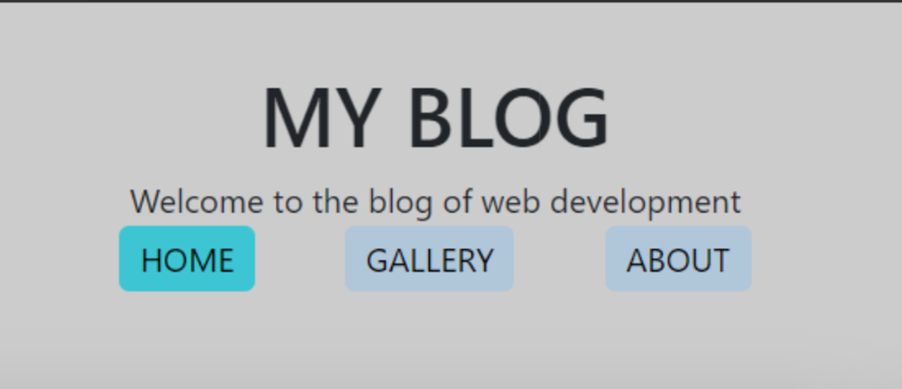
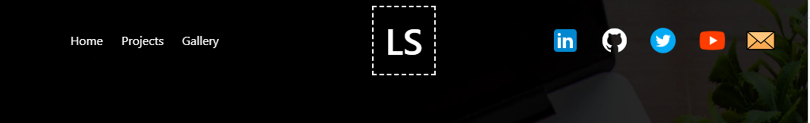
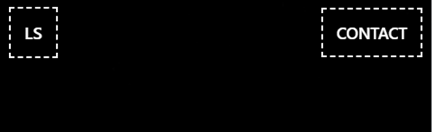
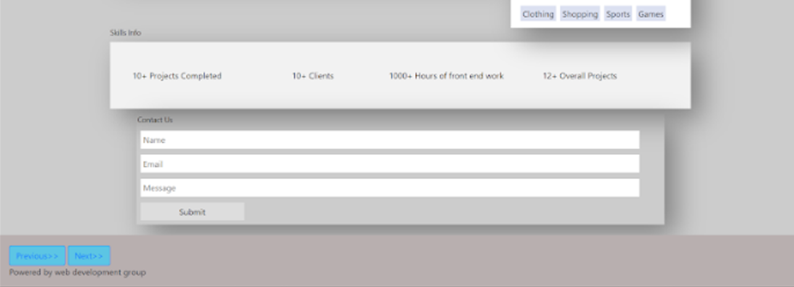
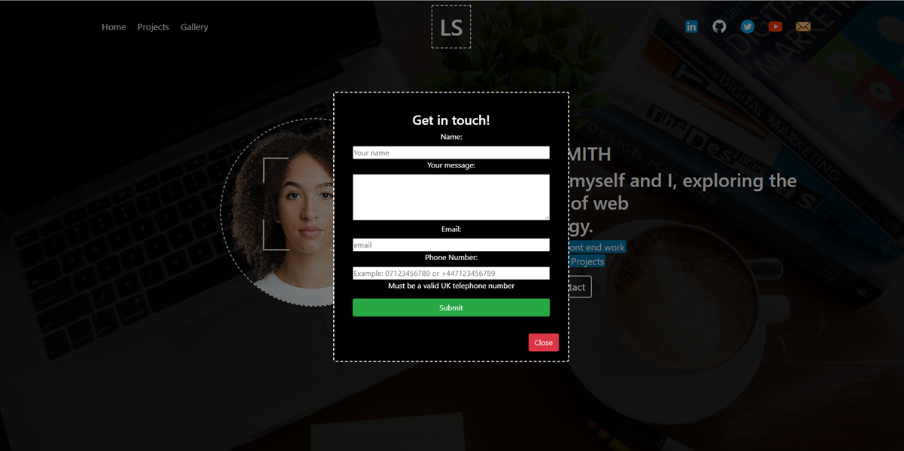
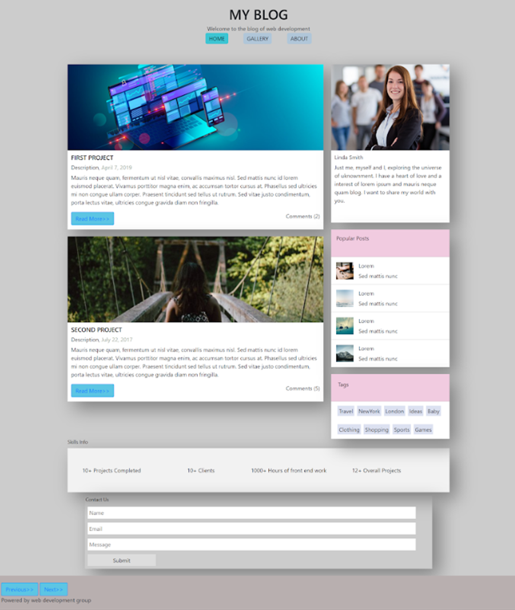
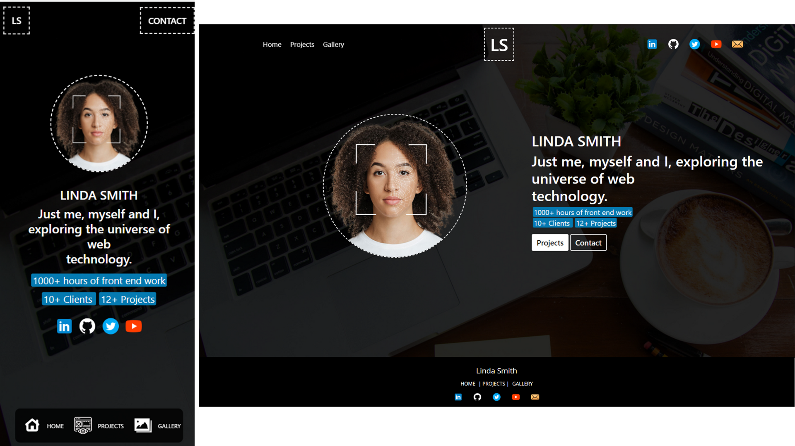
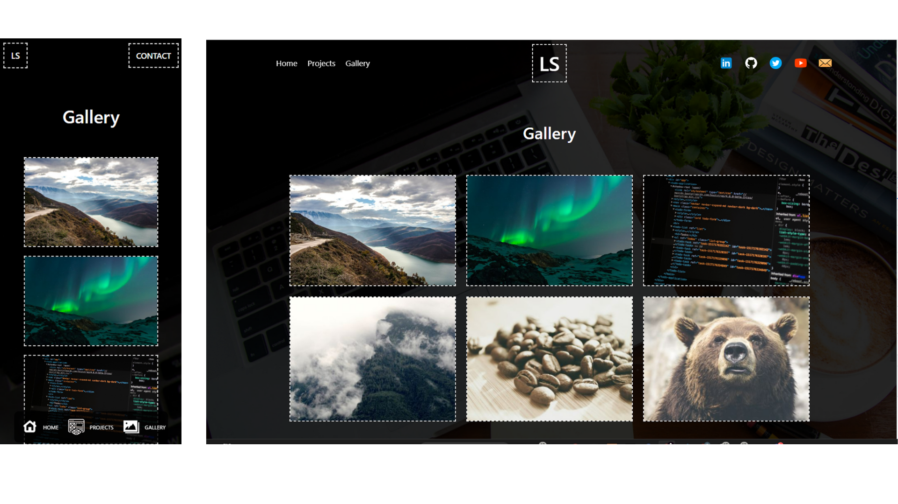

# Website improvments - By Zach delapenha

## CONTENTS

1. INTRODUCTION

2. INITIAL THOUGHTS

   - AREAS TO IMPROVE
   - IMPROVEMENTS TO IMPLEMENT

3. MY SOLUTION

   - NAVIGATION
   - CONTACT FORM
   - HOME PAGE
   - PROJECTS PAGE
   - GALLERY PAGE
   - FOOTER

4. SUMMARY

## 1. INTRODUCTION

In this assignment, I was tasked to improve a website's functionality and design based on a short brief. Here is my solution.

### TEHCNOLOGIES USED

    - HTML
    - CSS
    - JAVASCRIPT
    - BOOTSTRAP
    - JQUERY

## 2. INITIAL THOUGHTS

### AREAS TO IMPROVE

    1.  Navgiation bar is basic and unresponsive.
    2.  Page is cluttered with unrelated information.
    3.  The flow of information doesn't make sense, there needs to be a clear flow of information so the user can easily understand what the site is offering.
    4.  No branding.
    5.  Functionality doesn't work correctly.
    6.  Gallery is very basic, no way to view images in larger size.
    7.  Contact form has no form validation.
    8.  Footer is poorly designed and does not function in the way intended.
    9.  No clear call to action.

### IMPROVEMENTS TO IMPLEMENT

    1.  Create a responsive and clear navigation thats user friendly on all device sizes.
    2.  Organise the site so infomation is easily digestible.
    3.  Create a clear page structure.
    4.  Create unique branding for user recognition.
    5.  Fix functionality issues using javascript.
    6.  Create a clear gallery that has lightbox style functionality.
    7.  Implement form validation.
    8.  Design a clear and responsive footer.
    9.  Use UX design princles to highlight call to action buttons.

## 3. MY SOLUTION

### NAVIGATION

As mentioned the original navigation bar is very basic and unresponsive. I have created a new navigation bar that is responsive and has a clear flow of information. The navigation bar is now fixed to the top of the page and changes from transparent to a solid colour on scroll to prevent content overlap.

#### PROPOSED DESKTOP NAV

As you can see from my proposed design, the proposed navigation has three main sections, the page links on the left, the logo in the center and the social links on the right. The page links are in a clear order that makes sense to the user. The logo is in the center to create a clear brand identity. The social links are on the right to create a clear flow of information.

For the social links I chose to use coloured icons to allow the user to easily recognise each social meida platform by its personal branding, this also helped in giving the page a subtle colour scheme.

#### PROPOSED MOBILE NAV TOP

#### PROPOSED MOBILE NAV BOTTOM

On smaller devices mobile and tablet, I decided to divide the navigation into two sections, at the top of the page is the logo and the contact form link. Drawing the users attention to the contact form. At the bottom of the page I added a quick nav menu that is fixed to the bottom of the oage and clearly shows the user the page links. This allows the user to quickly navigate through the pages without having to stretch their thumbs to the top of their device screen, making it nore user friendly.

### CONTACT FORM

#### ORIGINAL CONTACT FORM

#### PROPOSED CONTACT FORM

### HOME PAGE

#### ORIGNAL HOME PAGE

#### PROPOSED HOME PAGE

### PROJECTS PAGE

    - Desktop

    - Tablet / mobile

### GALLERY PAGE

#### ORIGINAL GALLERY

#### PROPOSED GALLERY PAGE

#### GALLERY LIGHTBOX

 - Desktop

    - Tablet / mobile

### FOOTER

## 4. SUMMARY / REFERENCES

### SUMMARY

### REFERENCES
