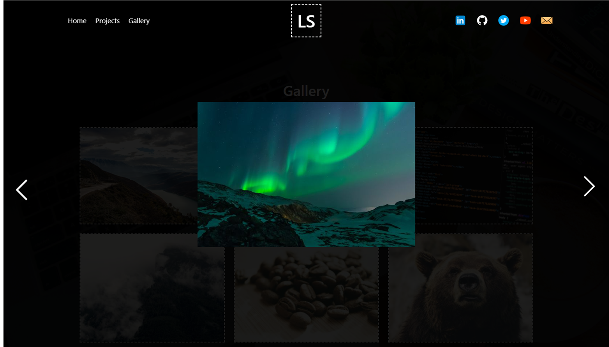

# Website improvments - By Zach delapenha

## CONTENTS

1. INTRODUCTION

2. INITIAL THOUGHTS

   - AREAS TO IMPROVE
   - IMPROVEMENTS TO IMPLEMENT

3. MY SOLUTION

   - NAVIGATION
   - CONTACT FORM
   - HOME PAGE
   - PROJECTS PAGE
   - GALLERY PAGE
   - FOOTER

4. SUMMARY

## 1. INTRODUCTION

In this assignment, I was tasked to improve a website's functionality and design based on a short brief. Here is my solution.

### TEHCNOLOGIES USED

    - HTML
    - CSS
    - JAVASCRIPT
    - BOOTSTRAP
    - JQUERY

## 2. INITIAL THOUGHTS

### AREAS TO IMPROVE

    1.  Navgiation bar is basic and unresponsive.
    2.  Page is cluttered with unrelated information.
    3.  The flow of information doesn't make sense, there needs to be a clear flow of information so the user can easily understand what the site is offering.
    4.  No branding.
    5.  Functionality doesn't work correctly.
    6.  Gallery is very basic, no way to view images in larger size.
    7.  Contact form has no form validation.
    8.  Footer is poorly designed and does not function in the way intended.
    9.  No clear call to action.

### IMPROVEMENTS TO IMPLEMENT

    1.  Create a responsive and clear navigation thats user friendly on all device sizes.
    2.  Organise the site so infomation is easily digestible.
    3.  Create a clear page structure.
    4.  Create unique branding for user recognition.
    5.  Fix functionality issues using javascript.
    6.  Create a clear gallery that has lightbox style functionality.
    7.  Implement form validation.
    8.  Design a clear and responsive footer.
    9.  Use UX design princles to highlight call to action buttons.

## 3. MY SOLUTION

### NAVIGATION

As mentioned the original navigation bar is very basic and unresponsive. I have created a new navigation bar that is responsive and has a clear flow of information. The navigation bar is now fixed to the top of the page and changes from transparent to a solid colour on scroll to prevent content overlap.

#### PROPOSED DESKTOP NAV

As you can see from my proposed design, the proposed navigation has three main sections, the page links on the left, the logo in the center and the social links on the right. The page links are in a clear order that makes sense to the user. The logo is in the center to create a clear brand identity. The social links are on the right to create a clear flow of information.

For the social links I chose to use coloured icons to allow the user to easily recognise each social meida platform by its personal branding, this also helped in giving the page a subtle colour scheme.

#### PROPOSED MOBILE NAV TOP

#### PROPOSED MOBILE NAV BOTTOM

On smaller devices mobile and tablet, I decided to divide the navigation into two sections, at the top of the page is the logo and the contact form link. Drawing the users attention to the contact form. At the bottom of the page I added a quick nav menu that is fixed to the bottom of the oage and clearly shows the user the page links. This allows the user to quickly navigate through the pages without having to stretch their thumbs to the top of their device screen, making it nore user friendly.

### CONTACT FORM

#### ORIGINAL CONTACT FORM

The original contact form is very basic and has no form validation. I have created a new contact form that has form validation. It is also hidden at the bottom of the page with no clear CTA button to draw the users attention to it.

#### PROPOSED CONTACT FORM

My solution to this problem was to completely remove the contact form from being static fixed to the bottom of the page and add it as a modal that is triggered when the user clicks the contact CTA buttons in the navigation bar, footer and hero secion on the home page. This allows the user to easily access the contact form without having to scroll to the bottom of the page. I have also added form validation to the contact form to make sure the user enters the correct information, and if they don't the form will not submit and alert the user to the error.

To achieve the form validation I linked it to a javascript file that checks the form input values and if they are not correct it will alert the user to the error and prevent the form from submitting.

My contact.js file does the following:

    - Gets all the inputs from the form and stores them in a variable.
    - Delcares a object that will be used to store the regex patterns for the form validation.
    - Creates a validation function that tests the input field against the respective regex patterns and dynamically adds a class name to each input field depending on the result. If the input is valid it will add a class name of 'valid' and if it is invalid it will add a class name of 'invalid'.
    - Creats a event listener that listens for the submit event on the form, if any of the input fields have the class name of 'invalid' the form will not submit and the user will be alerted to the error. If all the input fields have the class name of 'valid' the form will submit and the user will be alerted to the success.

On successful submit the form currently opens oper your default email app, but this can be changed easily to send a direct email to the site owner, or to send the form data to a database. For the purpose of this assignment I have left it as is just to display its functionality and validation.

### HOME PAGE

#### ORIGNAL HOME PAGE

The original home page is very basic, cluttered and has no clear flow of information. This makes it difficult for the user to understand what the site is offering, thus likely to negatively impact the user experience and conversion rate.

#### PROPOSED HOME PAGE

My solution to this problem was to create a new home page that has a clear flow of information and is easy to digest. I have also added a hero section to the top of the page to draw the users attention to the main call to action buttons.

For the colour scheme I went with black and white as it is a clean and simple colour scheme that is easy on the eye. I also added slight accent colours to the page to draw the users attention to key areas of the page.

As the site is a personal brand website, the main focus is to convert user into followers / customers so the focus is on the social links and contact form.

### PROJECTS PAGE

    - Desktop

    - Tablet / mobile

### GALLERY PAGE

#### ORIGINAL GALLERY

The original gallery page is very basic and has no lightbox functionality. This makes it difficult for the user to view the images in a larger size.

#### PROPOSED GALLERY PAGE

My solution to this problem was to create a new gallery page that had a clear flow of information and is easy to digest. I have also added a lightbox style functionality to the gallery images to allow the user to view the images in a larger size.

I achieved this by dynamically rendering the images to the page using javascript. I created a function that loops through the images and creates a div for each image and adds the image to the div. I then added a event listener to each image that listens for a click event and when the image is clicked it opens the lightbox and displays the image in a larger size. I had to alter the name of the images in order to allow my function to easily iterate through them.

This did pose a trade off, as I could not easily attribute a alt text to the images. However for the purpose of this assignment I felt this was the best solution to the problem while using vanilla javascript.

The gallery.js file does the following:

- first grabs all the relevant elements from the DOM and stores them in variables.
- Then creates an array of image indexes.
- Then declares a variable that will be used to store the current image index.
- Creates two functions to handle the opening and closing of the lightbox. openPopup() and closePopup().
- Creates a function that iterates through the image indexes and dynamically renders the images to the gallery page.
- Creates a event listener that listens for a click event on the gallery images and when the image is clicked it opens the lightbox and displays the image in a larger size.
- Creates two functions that handle the next and previous image buttons in the lightbox. showNextImage() and showPrevImage().
- Creates a event listener that listens for a click event in the lightbox and when its triggered it closes the light box.

#### GALLERY LIGHTBOX

 - Desktop

### FOOTER

#### ORIGINAL FOOTER

The original footer is very basic and has no clear CTA buttons to draw the users attention to the contact form. The next and previous buttons are also very small and did not work correctly.

#### PROPOSED FOOTER

My solution to this problem was to create a new footer that has a clear flow of information and is easy to digest.
My footer has a quick menu that allows the users to quickly navigate through the pages, a social link menu that allows the users to quickly navigate to the social links that are linked to the site owner's social media accounts, and a contact form CTA button that allows the users to quickly access the contact form.

## 4. SUMMARY / REFERENCES

### SUMMARY

### REFERENCES
